# Step 1: Create Two MySQL Tables

Table 1: All columns as VARCHAR(255) (no indexes)

```sql
CREATE TABLE people_raw (
    user_id VARCHAR(255),
    username VARCHAR(255),
    sex VARCHAR(255),
    email VARCHAR(255),
    phone VARCHAR(255),
    dob VARCHAR(255),
    job_title VARCHAR(255)
);

```

Table 2: Correct data types + indexes

```sql
CREATE TABLE people (
    user_id CHAR(15) PRIMARY KEY,
    username VARCHAR(100),
    sex ENUM('Male','Female'),
    email VARCHAR(100) ,
    phone VARCHAR(15) unique,
    dob DATE,
    job_title VARCHAR(255),
    INDEX idx_sex(sex),
    INDEX idx_job_title(job_title)
);

```

Notes:

dob as DATE instead of VARCHAR.
ENUM for sex to save space.
PRIMARY KEY and UNIQUE for faster lookups.
Added indexes on commonly queried columns.

# Step 2: Load Data

If your CSV is /var/lib/mysql-files/people-1M.csv:

For Table 1:

```sql
LOAD DATA INFILE '/var/lib/mysql-files/people-1M.csv'
INTO TABLE people_raw
FIELDS TERMINATED BY ','
OPTIONALLY ENCLOSED BY '"'
IGNORE 1 ROWS
(user_id, username, sex, email, phone, @dob, job_title)
SET dob = @dob; -- keeping as string
```

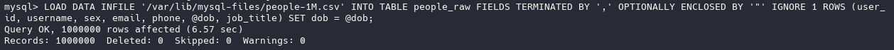

For Table 2 (convert DOB to proper date format):

```sql
LOAD DATA INFILE '/var/lib/mysql-files/people-1M.csv'
INTO TABLE people
FIELDS TERMINATED BY ','
OPTIONALLY ENCLOSED BY '"'
IGNORE 1 ROWS
(user_id, username, sex, email, phone, @dob, job_title)
SET dob = STR_TO_DATE(@dob, '%m/%d/%Y');
```


⚠️ Make sure all dates in CSV are in MM/DD/YYYY format for STR_TO_DATE to work.

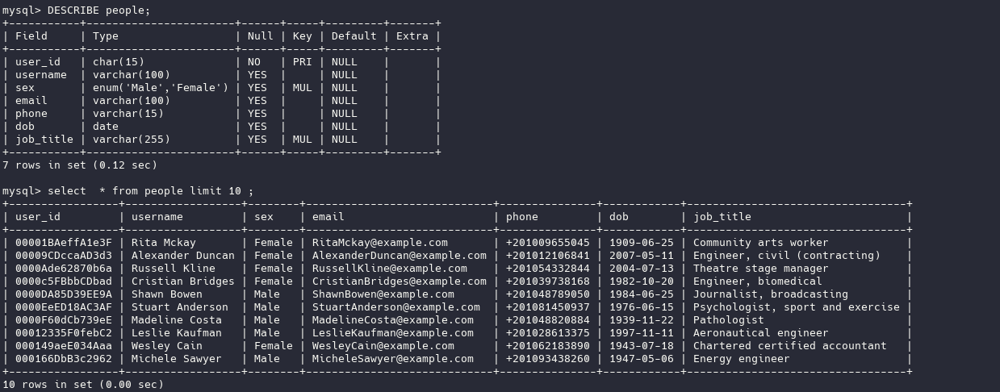

# Step 3: Performance Comparison

You can run the same queries on both tables to measure performance:

Aggregation examples:

1. COUNT total users

```sql
-- people_raw
EXPLAIN ANALYZE
SELECT COUNT(*) FROM people_raw;

-- people
EXPLAIN ANALYZE
SELECT COUNT(*) FROM people;
```

MySQL will output execution time in seconds for each table.

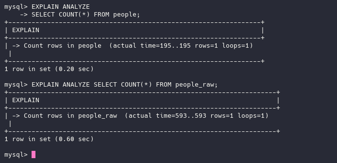

2. COUNT by sex

```sql
-- people_raw
EXPLAIN ANALYZE
SELECT sex, COUNT(*) FROM people_raw GROUP BY sex;

-- people
EXPLAIN ANALYZE
SELECT sex, COUNT(*) FROM people GROUP BY sex;
```

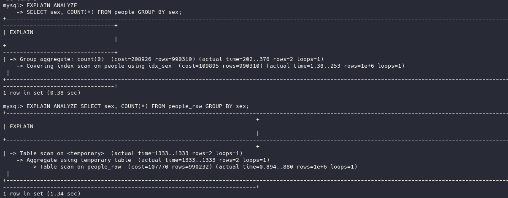

3. Filter with WHERE

```sql
-- people_raw
EXPLAIN ANALYZE
SELECT * FROM people_raw WHERE sex='Female';

-- people
EXPLAIN ANALYZE
SELECT * FROM people WHERE sex='Female';
```

EXPLAIN ANALYZE shows whether MySQL used full table scan or index.


4. GROUP BY / AVG age

```sql
-- people_raw
EXPLAIN ANALYZE
SELECT sex, AVG(YEAR(CURDATE()) - YEAR(STR_TO_DATE(dob, '%m/%d/%Y'))) AS avg_age
FROM people_raw
GROUP BY sex;

-- people
EXPLAIN ANALYZE
SELECT sex, AVG(YEAR(CURDATE()) - YEAR(dob)) AS avg_age
FROM people
GROUP BY sex;
```

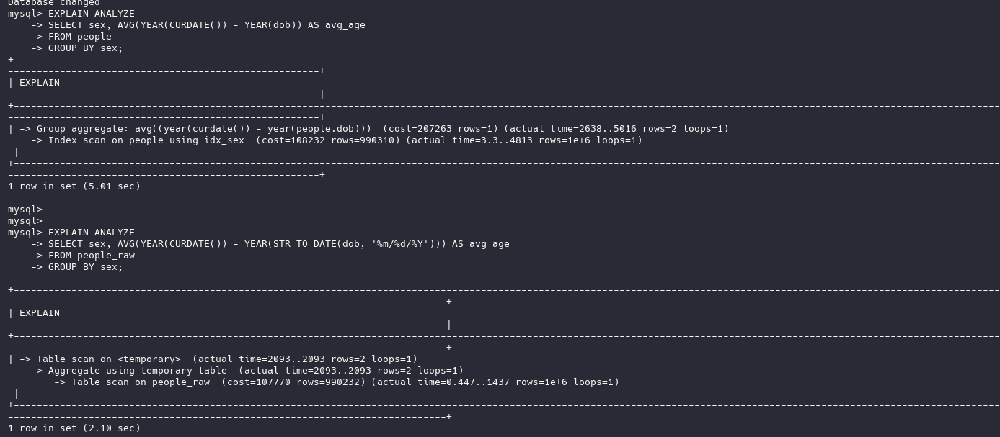

5. Sorting dob DESC with LIMIT

```sql
-- people_raw
EXPLAIN ANALYZE
SELECT * FROM people_raw ORDER BY dob DESC LIMIT 10;

-- people
EXPLAIN ANALYZE
SELECT * FROM people ORDER BY dob DESC LIMIT 10;
```

- without index

  raw data is sigltly faster because :

  people.dob is a DATE → slightly more CPU per row than VARCHAR (tiny difference).
  people_raw.dob is VARCHAR → sorting strings is slightly faster here because MySQL can do byte-wise comparisons instead of date computations.

  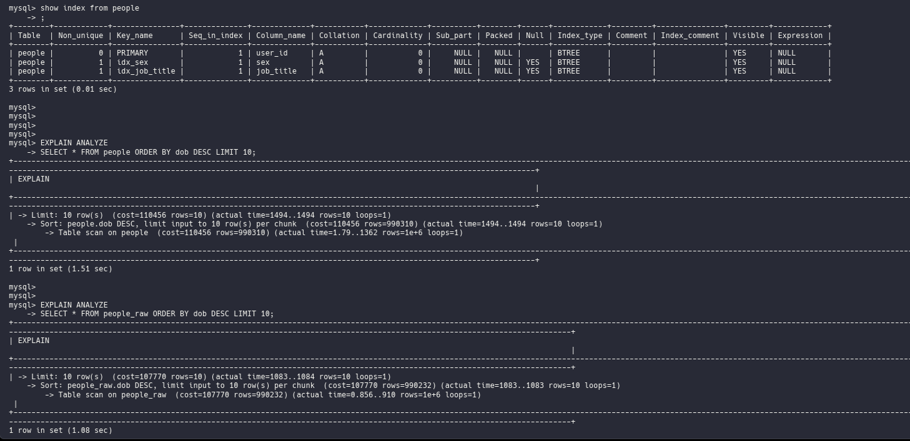

- with index
  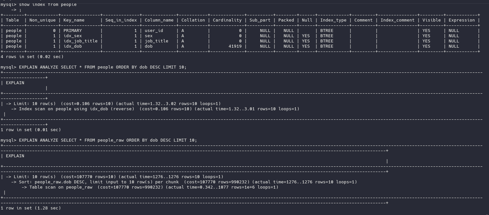

# Step 4: Backup & Automation

Backup Table 2:

```bash
mysqldump -u root -p perf_test people > /backups/people_backup.sql
```

Automate weekly backup (Linux cron):

Create a script

```bash

sudo vim /usr/local/bin/backup_people.sh
```

```bash
#!/bin/bash
DATE=$(date +%F)
mysqldump -u root -pYourPassword perf_test people > /backups/people_$DATE.sql
```

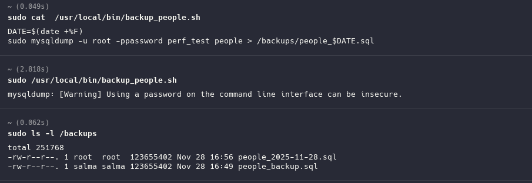

```bash
# Make it executable:
chmod +x /usr/local/bin/backup_people.sh
# Add cron job:
crontab -e
# Add:
0 2 * * 0 /usr/local/bin/backup_people.sh
```

This runs every Sunday at 2 AM.


# Step 5: Restore Test

```sql
CREATE TABLE people_restore LIKE people;
```

-- Restore backup

```bash
mysql -u root -p perf_test < /backups/people_backup.sql
```

Check data:

```sql
SELECT COUNT(*) FROM people_restore;
SELECT * FROM people_restore LIMIT 10;
```

Before restore:

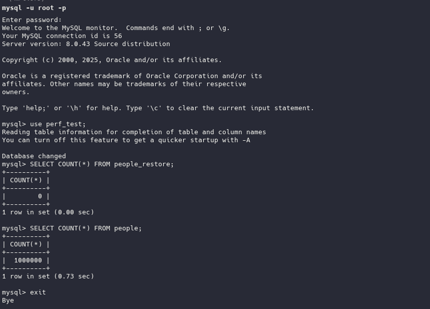

After Restore:


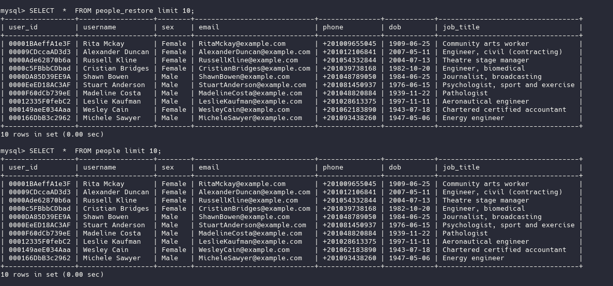

# Extract data from MySQL (Python, JDBC, or CSV export)

# Step 7: Install clickhouse and Load the same data into it

---

1️⃣ Install the ClickHouse

```bash
sudo yum install -y yum-utils
sudo yum-config-manager --add-repo https://packages.clickhouse.com/rpm/clickhouse.repo
```

2️⃣ Install ClickHouse server + client

```bash
sudo yum install -y clickhouse-server clickhouse-client
```

3️⃣ Start the Service

```bash
sudo systemctl enable clickhouse-server
sudo systemctl start clickhouse-server
```

Check status:

```bash
sudo systemctl status clickhouse-server
```

4️⃣ Connect to ClickHouse

```bash
clickhouse-client
```

# Step 8: Create the table in ClickHouse

ClickHouse is columnar (OLAP-friendly), so types differ slightly:

```sql
CREATE TABLE people_ch (
    user_id String,
    username String,
    sex Enum8('Male'=1, 'Female'=2),
    email String,
    phone String,
    dob Date,
    job_title String
) ENGINE = MergeTree()
ORDER BY user_id;
```

# Step 9: Extract data from MySQL

in side sql server

```sql
     SELECT user_id, username, sex, email, phone, dob, job_title
    -> INTO OUTFILE '/var/lib/mysql-files/people_clickhouse.csv'
    -> FIELDS TERMINATED BY ','
    -> OPTIONALLY ENCLOSED BY '"'
    -> LINES TERMINATED BY '\n'
    -> FROM people;
```

# Step 10: Load data into ClickHouse

```bash
 sudo cat /var/lib/mysql-files/people_clickhouse.csv \
    | sudo clickhouse-client --query="INSERT INTO people_ch FORMAT CSV"
```

# Step 11: Run analytical queries in ClickHouse

a) Count total users

```sql
SELECT COUNT(*) FROM people_ch;
```

b) Count by sex

```sql
SELECT sex, COUNT(*) FROM people_ch GROUP BY sex;
```

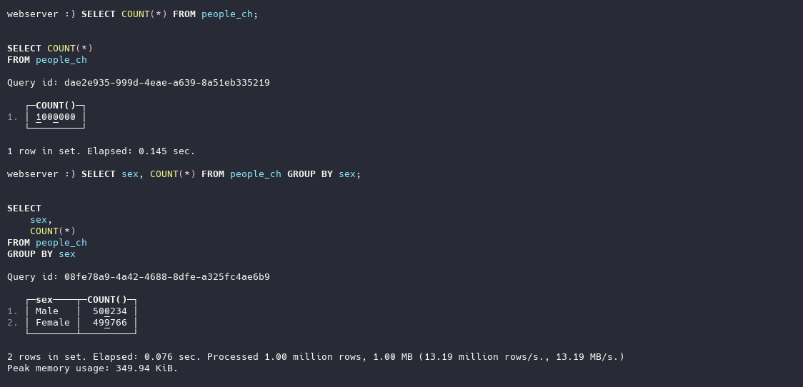

c) Filter WHERE sex='Female'

```sql
SELECT * FROM people_ch WHERE sex='Female';
```

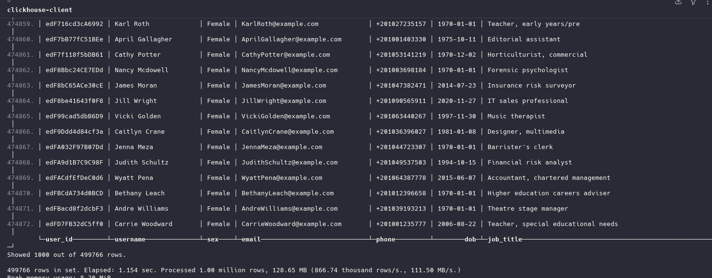

d) AVG age

```sql
SELECT sex, AVG(toYear(now()) - toYear(dob)) AS avg_age
FROM people_ch
GROUP BY sex;
```

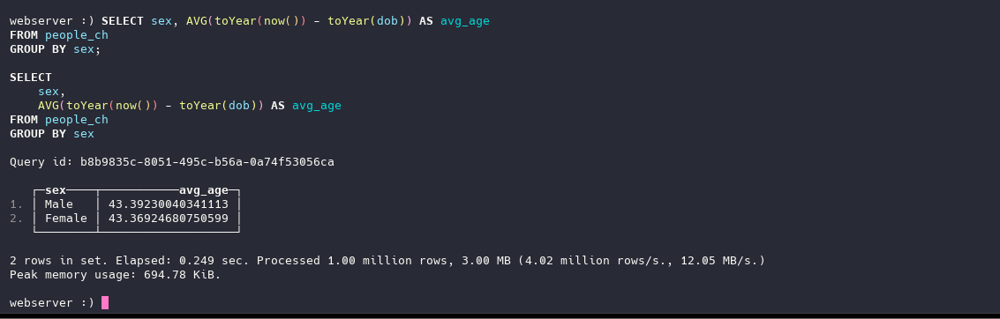

e) Sorting dob DESC with LIMIT

```sql
SELECT * FROM people_ch ORDER BY dob DESC LIMIT 10;
```

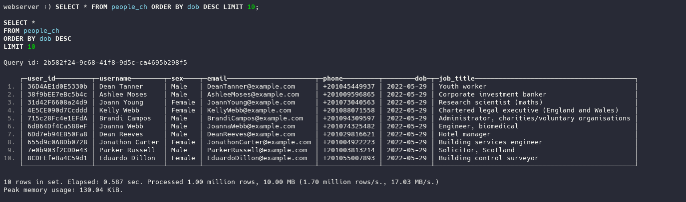

# Final Performance Comparison Table — MySQL vs ClickHouse

| Query                             | MySQL Time (sec)                                | ClickHouse Time (sec) | Winner                      | Reason                                                               |
| --------------------------------- | ----------------------------------------------- | --------------------- | --------------------------- | -------------------------------------------------------------------- |
| **a) COUNT total users**          | **0.20 s**                                      | **0.145 s**           | **ClickHouse**              | Columnar storage + vectorized execution → faster full scans.         |
| **b) COUNT by sex**               | **0.38 s**                                      | **0.076 s**           | **ClickHouse**              | GROUP BY is heavily optimized in ClickHouse.                         |
| **c) WHERE sex='Female'**         | **2.53 s**                                      | **1.154 s**           | **ClickHouse**              | Columnar filtering avoids reading unnecessary columns.               |
| **d) AVG age**                    | **5.01 s**                                      | **0.249 s**           | **ClickHouse (20× faster)** | CPU-heavy aggregation extremely fast in OLAP engines.                |
| **e) ORDER BY dob DESC LIMIT 10** | **1.51 s (no index)** / **0.02 s (with index)** | **0.587 s**           | **MySQL (with index)**      | Index lookup is O(log n), faster than CH full sort for small limits. |

---

# Mongodb Tasks

1. install mongodb

```bash
sudo vi /etc/yum.repos.d/mongodb-org-7.0.repo

# Paste the following content:

[mongodb-org-7.0]
name=MongoDB Repository
baseurl=https://repo.mongodb.org/yum/redhat/$releasever/mongodb-org/7.0/x86_64/
gpgcheck=1
enabled=1
gpgkey=https://www.mongodb.org/static/pgp/server-7.0.asc

# Install MongoDB

sudo yum install -y mongodb-org

# Start and enable MongoDB service

sudo systemctl start mongod
sudo systemctl enable mongod

# Connect to MongoDB shell
mongosh
```

2. Create a new MongoDB database

```sql
use people_db

```

3. Insert dummy data in shell not in mongosh

```bash

sudo mongoimport \
  --db people_db \
  --collection people \
  --type csv \
  --file /var/lib/mysql-files/people_clickhouse.csv \
  --fields user_id,username,sex,email,phone,dob,job_title

```

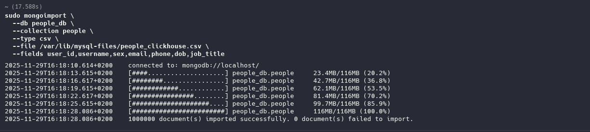

4. Create an index on one or more fields

```bash
db.people.createIndex({ sex: 1 })

db.people.createIndex({ dob: 1 })

#  Verify indexes
db.people.getIndexes()
```


5. Take a backup of the MongoDB collection

```bash
sudo mongodump \
  --db people_db \
  --collection people \
  --out /backups/mongo/
```


6. Restore it into a new collection

```bash
sudo mongorestore \
  --db people_db \
  --collection people_restore \
  /backups/mongo/people_db/people.bson

```

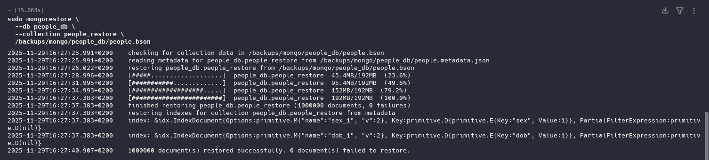

Verify restored table

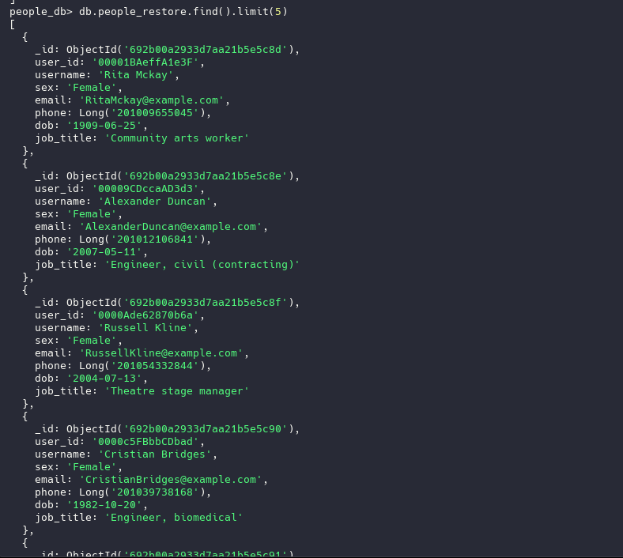
